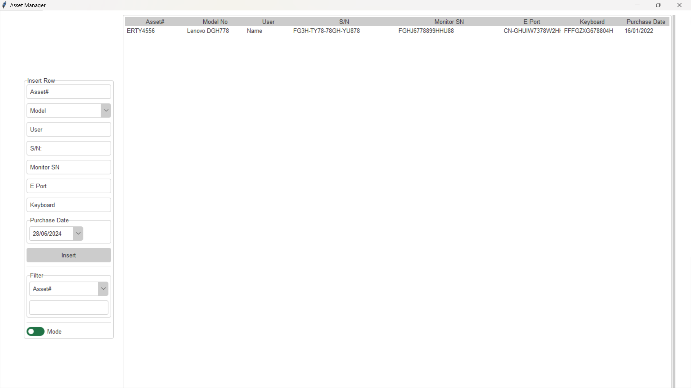
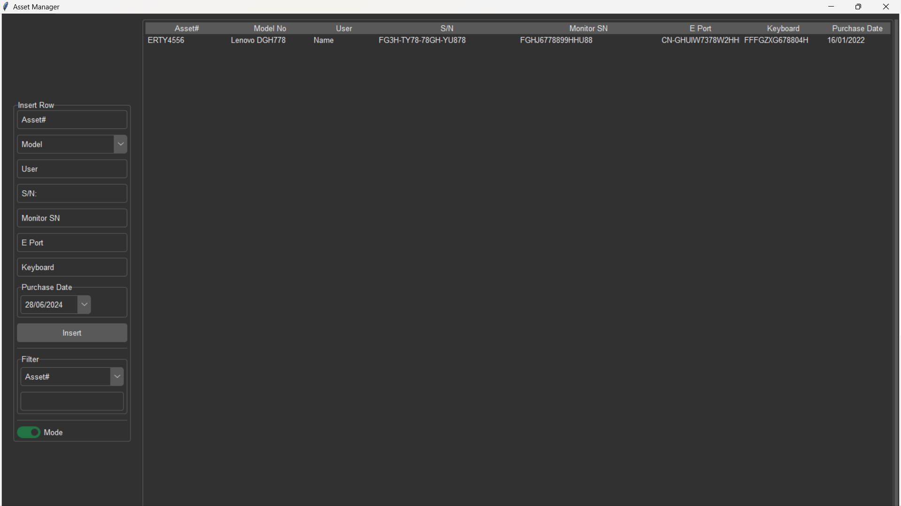

# Asset Manager

## Overview

**Asset Manager** is a powerful and user-friendly desktop application designed to help organizations and individuals efficiently manage their assets. Built using Python’s `tkinter` library, this app offers a modern and responsive interface for adding, searching, editing, and managing asset data, all stored conveniently in an Excel file.

The app supports theme toggling between light and dark modes and includes essential features like a calendar widget for date entries, a dynamic search system, and in-place editing of records. It is especially useful for small to medium-sized businesses that need a straightforward solution for asset tracking without investing in complex or expensive software.

## Key Features

- **Insert New Records:** Add new asset details such as Asset#, Model, User, S/N, Monitor S/N, E Port, Keyboard, and Purchase Date directly into the application.
- **Search and Filter:** Quickly filter and search records based on specific columns and keywords.
- **Edit Records:** Double-click any record in the list to open an edit dialog and make changes, which are automatically saved back to the Excel file.
- **Dynamic Theme Switching:** Toggle between light and dark themes using a simple switch, providing a comfortable user experience in various lighting conditions.
- **Excel Integration:** Seamlessly load and save asset data to and from an Excel file, allowing easy sharing and backup.
- **Date Entry Widget:** Use a calendar widget to select dates, making it easy to input or update purchase dates.

## Requirements

- **Python 3.x**
- **Libraries:**
  - `tkinter` (standard Python library)
  - `openpyxl` (Excel file handling)
  - `tkcalendar` (calendar widget for date entries)

You can install the necessary libraries using:

```bash
pip install openpyxl tkcalendar
```

## Installation

1. **Clone the Repository:**

   ```bash
   git clone https://github.com/yourusername/asset-manager.git
   cd asset-manager
   ```

2. **Prepare the Excel File:**

   Ensure you have an Excel file named `file.xlsx` in the root directory with the following structure:
   - Columns: `Asset#, Model No, User, S/N, Monitor SN, E Port, Keyboard, Purchase Date`
   - You can create one manually or use the provided [template](path_to_template.xlsx).

3. **Run the Application:**

   ```bash
   python asset_manager.py
   ```

## Usage

### Adding a New Asset

1. **Input Fields:**
   - **Asset#:** Enter the asset number.
   - **Model No:** Select the model from the dropdown.
   - **User:** Enter the name of the user responsible for the asset.
   - **S/N:** Enter the serial number.
   - **Monitor S/N:** Enter the serial number of the monitor (if applicable).
   - **E Port:** Enter the E port information.
   - **Keyboard:** Enter the keyboard details.
   - **Purchase Date:** Use the calendar widget to pick the purchase date.

2. **Insert Record:**
   - Click the "Insert" button to add the asset to the list and the Excel file.

### Searching and Filtering

1. **Select Column:**
   - Choose the column to search from the dropdown menu.

2. **Enter Search Term:**
   - Type the keyword in the search box. The list will dynamically update to show matching records.

### Editing an Asset

1. **Double-click on a Record:**
   - Opens the edit dialog with the current details.

2. **Edit Fields:**
   - Modify the values as needed.

3. **Save Changes:**
   - Click "Save" to update the record in the list and Excel file.

### Theme Switching

1. **Toggle Theme:**
   - Use the "Mode" switch button to change between light and dark themes.

## Screenshots

- **Light Theme:**

   <!-- Replace with actual path -->

- **Dark Theme:**

   <!-- Replace with actual path -->

## Technical Details

### Code Structure

- **Main Application (`asset_manager.py`):**
  - Initializes the `tkinter` window and sets up the main interface.
  - Functions for inserting, editing, and searching records.
  - Implements theme switching and data handling with Excel.

- **Styles and Themes:**
  - Uses external `.tcl` files (`forest-dark.tcl` and `forest-light.tcl`) for consistent theming.
  - Theme is toggled via the `toggle_mode` function.

### Key Functions

- **`load_data()`**: Loads asset data from the Excel file and populates the `Treeview`.
- **`insert_row()`**: Adds a new asset entry to the `Treeview` and the Excel file.
- **`reload_treeview(data)`**: Refreshes the `Treeview` with the provided data.
- **`search(event)`**: Filters the `Treeview` based on the search term and selected column.
- **`edit_row(event)`**: Opens an edit dialog to modify and save existing records.
- **`toggle_mode()`**: Switches between light and dark themes.

### File Structure

```
asset-manager/
│
├── file.xlsx              # Excel file storing asset data
├── forest-dark.tcl        # Dark theme style
├── forest-light.tcl       # Light theme style
├── asset_manager.py       # Main application script
└── README.md              # This file
```

## Contributing

We welcome contributions to enhance Asset Manager. To contribute:

1. **Fork the repository.**
2. **Create a new branch (`git checkout -b feature-branch`).**
3. **Commit your changes (`git commit -am 'Add new feature'`).**
4. **Push to the branch (`git push origin feature-branch`).**
5. **Create a new Pull Request.**

## License

This project is licensed under the MIT License. See the [LICENSE](LICENSE) file for more details.

## Acknowledgements

- [Tkinter](https://docs.python.org/3/library/tkinter.html): Python's standard GUI toolkit.
- [Openpyxl](https://openpyxl.readthedocs.io/): Python library for reading and writing Excel files.
- [Tkcalendar](https://github.com/j4321/tkcalendar): Calendar and date entry widgets for Tkinter.
